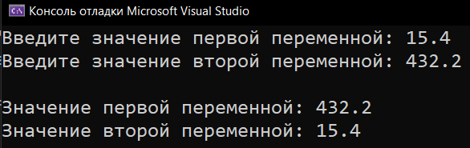
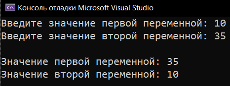

# Homework_2_Variables
Д/з: Переменные
* [Variables_Switch](Variables_Switch)
* [Variables_Switch_Without_Cell](Variables_Switch_Without_Cell)

  <h2>Variables Switch</h2>
  
Меняет значение 2-х переменных

  
  <h2>Variables Switch Without Cell</h2>
  
Меняет значение 2-х переменных без вспомогательной

  

